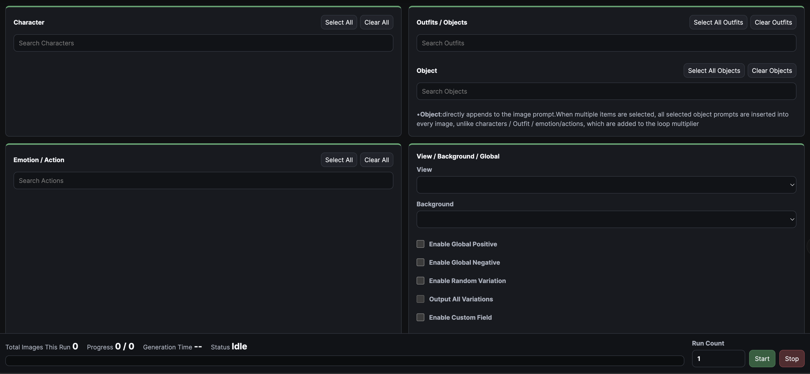

# Anima Image Set Generator

🇬🇧 English | 🇹🇼 Traditional Chinese | 🇰🇷 Korean

Anima Image Set Generator is a lightweight companion frontend for ComfyUI, designed to help generate structured image sets with Anima and compatible custom models.

The app uses a hybrid frontend + Python workflow instead of relying entirely on ComfyUI nodes for batch image-set generation. Running large batch sets purely through ComfyUI node logic can become extremely slow, so this tool manages the batch workflow in Python while sending generation jobs to ComfyUI.

It is also optimized for NVIDIA GPUs with 8 GB of VRAM. The app generates one image at a time, which helps avoid VRAM spikes and out-of-memory errors on lower-VRAM cards.

## Features

* Companion frontend for ComfyUI image-set generation.
* Python-assisted batch execution for faster and more stable workflows.
* Optimized for NVIDIA 8 GB VRAM GPUs by processing one image at a time.
* Supports Anima and other compatible custom diffusion models.
* Supports optional Turbo LoRA for faster generation.
* Supports optional upscale models.
* Includes prompt database editing, single-image tuning, batch set selection, and metadata parsing.

<table>
  <tr>
      
  </tr>
</table>


## Requirements

Before using the app, install the following:

* [ComfyUI](https://comfy.org/download)
* [Python](https://www.python.org/downloads/)

## Setup

### 1. Extract the App

Extract the downloaded ZIP file and place the folder anywhere convenient on your computer.

### 2. Install ComfyUI and Python

Install ComfyUI and Python if they are not already installed.

### 3. Install the Shared Anima Models

Download the two shared Anima model files:

* [Anima TEXT encoder](https://huggingface.co/circlestone-labs/Anima/resolve/main/split_files/text_encoders/qwen_3_06b_base.safetensors?download=true)
* [Anima VAE](https://huggingface.co/circlestone-labs/Anima/resolve/main/split_files/vae/qwen_image_vae.safetensors?download=true)

Place them in the following ComfyUI model folders:

```text
ComfyUI-Shared/models/text_encoders
ComfyUI-Shared/models/vae
```

These two files are shared by Anima models.

### 4. Install the Diffusion Model

Download an Anima model or another compatible custom model, then place it in:

```text
ComfyUI-Shared/models/diffusion_models
```

### 5. Optional: Install Turbo LoRA

To use Turbo LoRA, place the LoRA file in:

```text
ComfyUI-Shared/models/loras
```

Turbo LoRA is strongly recommended. In testing, it can reduce generation time significantly, for example from around 50 seconds per image to around 10 seconds per image, depending on your hardware and settings.

### 6. Optional: Install Upscale Models

To use an upscale model, place it in:

```text
ComfyUI-Shared/models/upscale_models
```

## How to Launch

1. Open Comfy Desktop and start ComfyUI.
2. Double-click `start_app_windows.bat` inside the app folder.

The app will launch as a local frontend that connects to your running ComfyUI instance.

## App Tabs

The app is organized into five main tabs:

### Model Parameters

Configure all model-related settings, including diffusion models, text encoders, VAE, LoRA, sampler settings, image size, steps, CFG, scheduler, seed, and other generation parameters.

### Image Set Settings

Select the image sets you want to generate. This tab controls which character, outfit, action, view, background, and prompt combinations will be included in the batch.

### Data Editor

Edit the prompt database used by the app. You can customize characters, outfits, actions, views, backgrounds, objects, and other prompt components.

### Tuning Comparison

Generate and compare single images before running a full image set. This tab is recommended for adjusting the visual style, prompts, LoRA strength, and model parameters before starting a batch run.

### Image Parser

Drop in an image with embedded metadata to inspect how it was generated. This is useful for reviewing previous outputs and reusing or adjusting their settings.

## Output Location

Generated images are saved to the ComfyUI output folder:

```text
ComfyUI-Shared/output
```

## Performance Notes

For best performance, Turbo LoRA is recommended. It can greatly reduce generation time when used with compatible models and settings.

For NVIDIA GPUs with 8 GB of VRAM, the app is designed to process one image at a time. This helps keep memory usage stable and reduces the chance of out-of-memory errors during batch generation.

## Recommended Workflow

1. Start ComfyUI.
2. Launch this app with `start_app_windows.bat`.
3. Configure your models and generation parameters in **Model Parameters**.
4. Use **Tuning Comparison** to test and refine the style.
5. Edit or expand your prompt database in **Data Editor** if needed.
6. Select the desired batch combinations in **Image Set Settings**.
7. Run the image set generation.
8. Check the generated images in `ComfyUI-Shared/output`.
